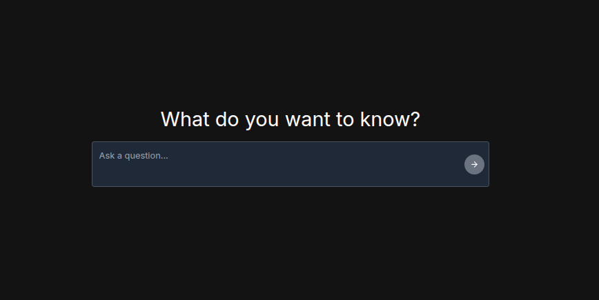

# LangChain Chatbot Project

An end-to-end AI Chat application built using LangChain, FastAPI. This project is done as an exercise to understand the concepts of RAG Pipelines, Agent Tools, Langchain, FastAPI, Streaming and their use in the LLM World. 

Here is the Deployed Applicatioon: http://langchain-bot-alb-177873306.us-east-2.elb.amazonaws.com/

<table>
  <tr>
    <td>
      
      
Chatbot Front End

    </td>
    <td>
      
      
Chatbot Query 

    </td>
  </tr>
</table>
Try these Queries:

1. What is the time in Greece?
2. What is the weather in India and Dubai? Give me the latest news of these places.
3. What is 2*2?

The Application uses the OpenAI LLM and builds an agent to perform Websearch (SerpAPI) and Mathematical operations.

## Key Features

I have implemented a ReAct (Reasoning and Acting) AI agent that can use multiple tools to answer user queries while streaming its reasoning process in real-time.

### Tech Stack

* Backend: FastAPI + LangChain + OpenAI GPT-4
* Frontend: Next.js
* Tools: SerpAPI (Web Search), Mathematical Operations
* Deployment: Docker + AWS ECS
* Streaming: Server-Sent Events (SSE)

### Implementation

#### AI Agent Backend:
I implemented a robust FastAPI application that hosts a LangChain agent capable of using multiple tools to interact with data and provide intelligent responses.

Key Implementation Details:
* Single /invoke POST endpoint for all agent interactions

* CORS configuration for seamless frontend-backend communication

* Async request handling for optimal performance

#### Real-Time Streaming Responses
I developed a streaming system using Server-Sent Events to provide real-time conversational experiences with visual agent reasoning steps.

Streaming Features Implemented:
* QueueCallbackHandler: Custom async callback handler for real-time token streaming

* Token Processing: Intelligent parsing of tool calls, arguments, and step transitions

* XML Markup: Structured streaming with step and step_name tags for frontend parsing

* Error Handling: Robust error recovery during streaming to prevent connection drops

#### Custome Agent Executor
I built a custom CustomAgentExecutor class that manages the agent's conversation flow, tool execution, and iteration control.

The following are the features:
* Conversation Memory: Maintains persistent chat history across interactions

* Agent Scratchpad: Tracks intermediate reasoning steps and tool outputs

* Iteration Control: Prevents infinite loops with configurable max iterations

* Tool Execution Flow: Orchestrates sequential tool usage until final answer

#### Multi-Tool Integration
Here, I implemented a comprehensive tool ecosystem with both synchronous and asynchronous capabilities.

Mathematical operations, Web Search via SerpAPI with async HTTP requests and Final answer tool for response completion are some of the major ones.

#### LangChain Expression Language (LCEL)
Here, I utilised LCEL to create agent pipelines with dynamic prompt templates and tool binding.

I have used lambda fucntions, prompt template, tool bindings and chain composition using pipeline operators to implement the agent framework.

#### Next.js Front end integration
I developed a responsive chat interface that consumes the streaming API and displays agent reasoning steps in real-time.

#### Production Deployment Pipeline
I containerized the entire application and implemented a complete AWS deployment pipeline.

* ECR: Container registry for Docker image storage

* ECS Clusters: Container orchestration with auto-scaling

* Application Load Balancer: Traffic distribution across instances

* Production Scalability: Horizontal scaling based on demand

## Running the app

Clone the repository. the repository has two subfolders: lc-backend and lc-frontend

Create a .env from .env.example and enter the API keys.

### For Running the backend. 

Go to root folder. Open Terminal in this folder and enter these commands

> cd lc-backend\
> curl -LsSf https://astral.sh/uv/install.sh | sh\
> uv python install 3.12.7\
> uv venv --python 3.12.7\
> uv sync

Now enter the folder api

> cd api\
> uv run uvicorn main:app --reload

This will run the Backend and we can check it; https://localhost:8000/docs

### For running the FrontEnd. 

Open a terminal in the lc-frontend folder

or from root folder

> cd lc-frontend

Then type these commands

> npm install\
> npm run dev
